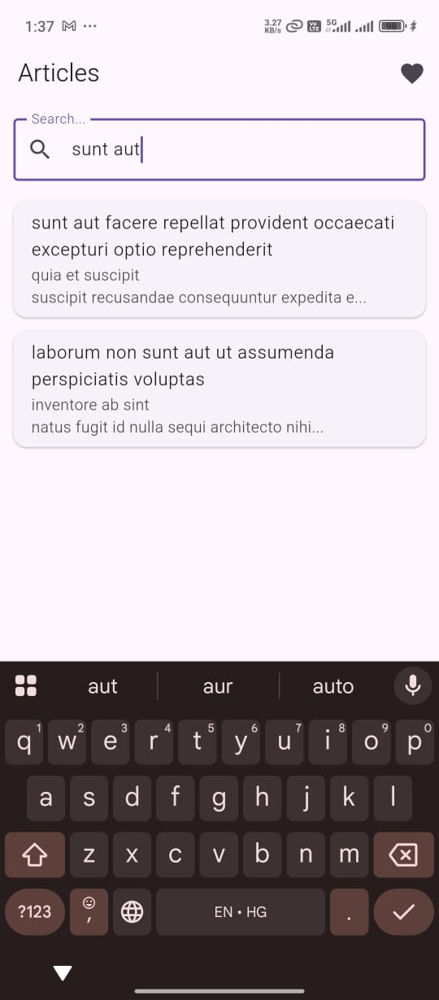

# 📰 Flutter Article App

A clean and lightweight Flutter app that fetches and displays a list of articles from a public API with search and detail views. Designed with modularity and simplicity in mind using Provider for state management.

---

## ✨ Features

- 🔄 Fetch articles from [JSONPlaceholder](https://jsonplaceholder.typicode.com/posts)
- 🔍 Client-side search by title or body
- 📄 Article detail screen with full content (title & body)
- ⚙️ Graceful error handling
- ⏳ Loading indicator while fetching
- 🔁 Pull-to-refresh support *(Bonus)*
- ⭐ Favorite articles with persistent local storage using Hive *(Bonus)*

---

## 🚀 Setup Instructions

1. **Clone the repository**:
   ```bash
   git clone https://github.com/RaviYadavO4/flutter_article_app.git
   cd flutter_article_app

2. **Install dependencies:**

- provider: ^6.1.1
- http: ^0.14.0
- hive: ^2.2.3
- hive_flutter: ^1.1.0

3. **Run the app**
- flutter run


## 🛠️ Tech Stack
- Tool/Library	Purpose
- Flutter SDK 3+	Mobile UI Framework
- Provider	State Management
- http	REST API integration
- Hive	Local data persistence (favorites)

## 🧠 State Management Explanation

The app uses Provider with ChangeNotifier to manage application state. The ArticleProvider class handles fetching articles, managing search queries, and maintaining favorites. Widgets subscribe to state changes using Consumer or Selector, allowing for efficient and responsive UI updates.

## 📁 Folder Structure

```text
lib/
│
├── main.dart                      # App entry point
│
├── models/
│   └── article.dart               # Article model
│
├── services/
│   └── api_service.dart           # HTTP logic for fetching articles
│
├── providers/
│   └── article_provider.dart      # State management with ChangeNotifier
│
├── screens/
│   ├── home_screen.dart           # Home screen with list and search
│   ├── detail_screen.dart         # Article detail view
│   └── favorites_screen.dart      # Favorites list (Bonus)
│
├── widgets/
│   ├── article_card.dart          # Reusable UI card
│   └── search_bar.dart            # Search UI
│
└── utils/
    └── hive_boxes.dart            # Hive box initialization
```


## ⚠️ Known Issues / Limitations
No pagination support (loads all posts at once)
No offline mode for articles
Favorites are stored locally only (not synced or backed up)
No error retry button (yet)

## 📸 Screenshots

| 🏠 Home Screen                | 🔍 Search Functionality        |
|-------------------------------|--------------------------------|
|   |  |
| **Home Screen**               | **Search Functionality**       |

| 📄 Article Detail View        | 📄 Favorites View              |
|-------------------------------|--------------------------------|
|  |  |
| **Article Detail View**       | **Favorites View**     

## 🎥 Video Walkthrough

Watch the video walkthrough for a detailed overview of the app:

[](https://youtube.com/shorts/BMdsFp2xF-E)


## 📌 Author

**Ravi Yadav**  
🔗 [GitHub Profile](https://github.com/RaviYadavO4)